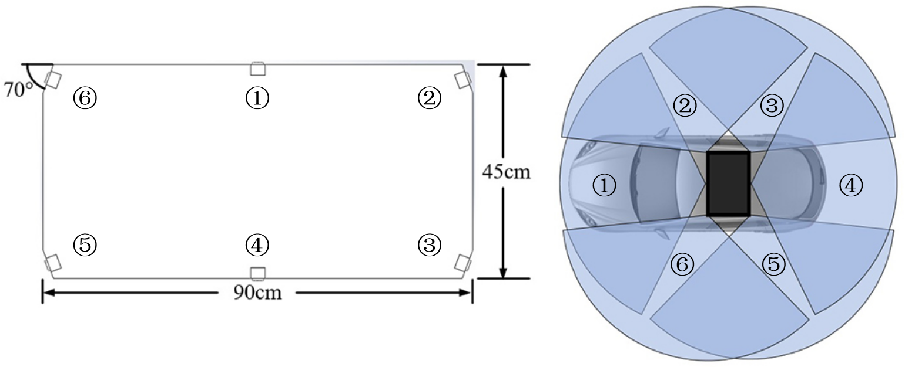

# MCOV-SLAM: A Multi-Camera Omnidirectional Visual SLAM System

## Abstract

Multi-camera based visual simultaneous localization and mapping (SLAM) systems prove to be more effective and robust for complex scenarios than monocular based ones due to their capacity of reaching more environmental information. However, most existing multi-camera SLAM methods only extend on the basis of traditional single-camera methods and just use multiple cameras for tracking more feature points, in which the design of the front-ends and sensor layout are less theoretically grounded, such as the heuristic condition of inserting a new keyframe. Moreover, the omnidirectional perception ability of multi-camera system has not been fully utilized in most existing methods. When performing place recognition, existing methods still need to get the point in similar position and orientation like what single-camera methods perform, rather than in any direction. To eliminate human heuristics, elevate loop-closing ability and boost system's performance, this article proposes a multi-camera visual SLAM method based on observability and omnidirectional perception. The key novelties of this work are the designing of an omnidirectional loop-closing method and a new keyframe decision method based on system's observability analysis. Firstly, an observation model for multi-camera system is constructed and analyzed, which provides a theoretical basis for system’s sensor layout design and the further enhancement of multi-camera visual SLAM method. Secondly, a feature matching result screening method and a novel keyframe decision method based on observability are proposed to ameliorate the precision and reliability of system. Lastly, an omnidirectional loop-closing method that fuses all cameras' information is proposed to realize loop detection and correction without sensor's direction constraint. Extensive experimental results demonstrate that the proposed MCOV-SLAM method has good augmentation in terms of system's accuracy and robustness.

**Index terms:** Multi-camera, Omnidirectional Perception, Observability, Simultaneous Localization And Mapping.

## Dataset

We provide the datasets used in this paper, including 4 sequences.

### Sensor Setup

Schematics of the acquisition platform is given below. The camera intrinsics and extrinsics are provided in [calibration_result.yaml](./calibration_result.yaml).

### Dataset Source

| Sequence Name | Duration(s) | Size(GB) |                             Link                             |
| :-----------: | :---------: | :------: | :----------------------------------------------------------: |
|    route1     |    430.3    |   10.0   | [BaiduNetdisk](https://pan.baidu.com/s/1n_a9Tdg3Z0tOtRrHSy2Iuw?pwd=oe6h) |
|    route2     |    628.1    |   14.0   | [BaiduNetdisk](https://pan.baidu.com/s/1JJLdJetYOFf1XY3O-ZCAeQ?pwd=jsop) |
|    route3     |    631.6    |   10.4   | [BaiduNetdisk](https://pan.baidu.com/s/156ROJfElnw8rBYlhiP7rMQ?pwd=t7ez) |
|    route4     |    639.7    |   12.9   | [BaiduNetdisk](https://pan.baidu.com/s/1m4cAL34WfiRaY8ZAp7ukDQ?pwd=36fv) |

